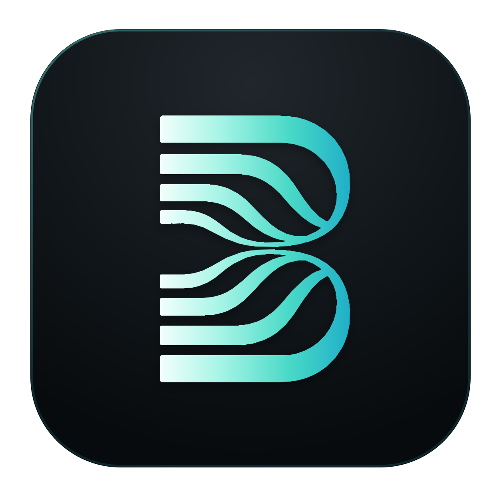

<p align="center">
  
</p>

<h1 align="center">Basis</h1>

<p align="center">
  A local-first, data-driven desktop music player for people who want their library to remain theirs.
</p>

<p align="center">
  <a href="https://github.com/JoaEinsson/Basis/actions/workflows/release.yml"></a>
  <a href="https://github.com/JoaEinsson/Basis/releases/latest"></a>
  <a href="LICENSE"></a>
</p>

Basis turns an existing music folder into a searchable, customizable library
without rearranging the audio files. Metadata drives albums, artists, genres,
folders, saved views, playlists, search, and playback; a rebuildable SQLite
index keeps those operations fast while user-authored state remains portable.

> [!IMPORTANT]
> Basis is an early `0.1.x` release. Back up any library you care about before
> evaluating new software. Basis does not move, rename, edit, or delete audio
> files, but it does create a hidden `.musiclib/` directory inside the folder
> selected as the library.

## Highlights

- **Your folder is the library.** Basis indexes music in place instead of
  importing it into a proprietary directory.
- **Metadata-first browsing.** Explore albums, artists, tracks, folders, and
  genres without assuming that the folder layout defines the collection.
- **One flexible View Engine.** Combine free text, structured filters, sorting,
  grouping, columns, density, and Grid/List/Table representations, then save the
  result as a custom view.
- **Real desktop playback.** Queue, play/pause, seek, volume, next/previous,
  shuffle, repeat, session restore, media keys, and gapless priming when the
  audio path supports it.
- **Static and smart playlists.** Playlist definitions use portable relative
  paths or queries; the playback queue remains a separate transient concept.
- **Synchronized lyrics.** Resolve lyrics through LRCLIB with conservative
  matching, synchronized seeking, offline sidecars, and explicit review for
  ambiguous candidates.
- **Data-driven themes.** Paper, Nocturne, and artwork-adaptive Chromatic share
  the same versioned token system. Custom themes can be edited, imported,
  exported, and carried with the library.
- **Portable history.** Favorites and listening history are append-only,
  per-device events that can rebuild the local projection.
- **Live library updates.** A recursive watcher incrementally reflects added,
  changed, or removed music and externally synchronized portable data.
- **No telemetry.** Browsing and playback work offline. Network access is
  limited to requested LRCLIB resolution and signed update checks.

## Supported platforms and audio

| Platform | Distribution |
|---|---|
| Windows 10/11 x86-64 | NSIS installer |
| Linux x86-64 | AppImage |

The tested codec targets are MP3, FLAC, AAC/M4A, ALAC/M4A, Ogg Vorbis, WAV,
and Opus. Basis currently uses the system default audio output device. macOS is
not an initial release target.

## Install

Download the newest build from [GitHub Releases](https://github.com/JoaEinsson/Basis/releases/latest).

### Windows

Download and run the x86-64 NSIS installer. Update artifacts are signed for the
Basis updater, but the initial releases do **not** have a paid Authenticode
publisher certificate. Windows SmartScreen may therefore show an
unknown-publisher warning. Verify that the installer came from this repository's
release page before continuing.

### Linux

Download the x86-64 AppImage, mark it executable, and run it:

```bash
chmod +x ./Basis*.AppImage
./Basis*.AppImage
```

The AppImage targets ordinary x86-64 processors; `x86_64`/`amd64` names describe
the instruction-set architecture and work on supported 64-bit Intel and AMD
CPUs. Distribution-specific desktop-menu integration is not automated in the
current release.

## First run

1. Select **Add folder** and choose the directory that contains your music.
2. Let the initial scan build the local index and bounded artwork cache. A large
   collection can take a while on its first pass.
3. Browse while scanning completes. Later starts reuse the index, and the
   watcher processes ordinary changes incrementally.

Selecting a new root, moving a library to a new absolute path, or deleting the
local application database requires a full rebuild. This is intentional: the
SQLite database is disposable and can be recreated from the audio files and
portable `.musiclib/` state.

## Portable library model

Basis separates durable library state from device-local acceleration:

| Location | Contents |
|---|---|
| Music folder | Existing audio files, unchanged by Basis |
| `<library>/.musiclib/` | Manifest, workspace, views, playlists, themes, lyrics, overrides, and per-device event logs |
| OS application data | Rebuildable SQLite index, local settings, and paused queue/session state |
| OS cache | Generated artwork thumbnails and other disposable cache data |

All portable references use normalized paths relative to the chosen library
root. Copying or synchronizing the complete library — including `.musiclib/` —
therefore preserves authored state without storing the previous machine's
absolute path. Basis consumes the resulting filesystem state but deliberately
does not implement sync-tool-specific conflict resolution.

## Search and keyboard

Structured predicates can be mixed with free text, for example:

```text
artist:"Massive Attack" year:>=1998 favorite:true
```

| Shortcut | Action |
|---|---|
| `Ctrl/Cmd + F` or `/` | Open the full library search view |
| `Ctrl/Cmd + K` | Open the command palette |
| `Space` | Play or pause when focus is outside an editable control |
| Media play/next/previous keys | Control playback |
| `Esc` | Close the active menu, palette, or transient interaction |

## Privacy and security

- No analytics, telemetry, account, or cloud library is required.
- Audio, metadata, artwork, themes, playlists, and lyrics are treated as
  untrusted input and pass through bounded Rust-side parsing and validation.
- The webview has a restrictive content security policy and a minimal Tauri
  capability set.
- LRCLIB is contacted only when lyrics are requested; resolved synchronized
  lyrics can be reused offline.
- Update checks use the signed stable channel on this repository. Signature
  verification is never bypassed after a network failure.

## Development

### Prerequisites

- [Node.js 22](https://nodejs.org/) and Corepack
- pnpm `11.17.0` (locked in `package.json`)
- the stable Rust toolchain
- the [Tauri 2 system prerequisites](https://v2.tauri.app/start/prerequisites/)

The Ubuntu 22.04 release job additionally installs
`libwebkit2gtk-4.1-dev`, `libappindicator3-dev`, `librsvg2-dev`, `patchelf`, and
`libasound2-dev`. Use the equivalent packages for your distribution.

### Run locally

```bash
corepack enable
pnpm install --frozen-lockfile
pnpm tauri dev
```

### Quality checks

```bash
pnpm format:check
pnpm lint
pnpm typecheck
pnpm test
pnpm build

cargo fmt --manifest-path src-tauri/Cargo.toml -- --check
cargo clippy --manifest-path src-tauri/Cargo.toml --all-targets --all-features -- -D warnings
cargo test --manifest-path src-tauri/Cargo.toml --all-features

pnpm audit --prod
cargo audit --file src-tauri/Cargo.lock
```

`cargo audit` requires the separately installed
[`cargo-audit`](https://crates.io/crates/cargo-audit) command.

### Package

Build on the target operating system:

```bash
# Windows
pnpm tauri:build:windows

# Linux
pnpm tauri:build:linux
```

Production releases are created only from matching `v<semver>` tags. The
workflow builds Windows and Linux artifacts, signs updater payloads, validates
the combined metadata, and keeps incomplete releases as drafts. Maintainer key
setup and the complete process are documented in
[`docs/RELEASE_AND_SIGNING.md`](docs/RELEASE_AND_SIGNING.md).

## Repository map

```text
src/                 React interface, application state, and typed Tauri clients
src-tauri/src/       Rust library, index, player, lyrics, themes, and updater policy
assets/brand/        Source artwork for the Basis identity
fixtures/            Generated audio and signed-updater regression fixtures
schemas/             Portable JSON schemas
scripts/             Release, manifest, signing, and AppImage validation tools
docs/                Product decisions, architecture, UX, acceptance, and evidence
```

The main engineering references are:

- [`DATA_DRIVEN_MUSIC_PLAYER_SPEC.md`](DATA_DRIVEN_MUSIC_PLAYER_SPEC.md) —
  canonical product specification;
- [`docs/DECISIONS.md`](docs/DECISIONS.md) — locked product and engineering
  decisions;
- [`docs/DESIGN_UX.md`](docs/DESIGN_UX.md) — navigation, composition, and
  responsive interaction contract;
- [`docs/ARCHITECTURE.md`](docs/ARCHITECTURE.md) — system boundaries and data
  ownership;
- [`docs/ACCEPTANCE.md`](docs/ACCEPTANCE.md) and
  [`docs/PROGRESS.md`](docs/PROGRESS.md) — verification matrix and current
  evidence;
- [`docs/UI_UX_POLISH_PLAN.md`](docs/UI_UX_POLISH_PLAN.md) — accepted post-MVP
  polish program.

## Project status and scope

The `0.1.0` MVP gates M0–M8 are complete. Version `0.3.0` contains the post-MVP
UI/UX polish work through P7. Current non-goals include EQ/DSP, exclusive or
verified bit-perfect output, manual output-device selection, cloud accounts,
automatic metadata enrichment, word-by-word lyrics, and recommendation radio.

## Contributing

Issues and focused pull requests are welcome. Before changing behavior, read
the specification, relevant locked decisions, and architecture/UX contracts.
Keep portable data backward-compatible, do not commit private signing material,
and include tests for behavior changes. Run the quality checks above before
opening a pull request.

Unless explicitly stated otherwise, contributions intentionally submitted for
inclusion in Basis are accepted under the same Apache-2.0 terms.

## License

Copyright 2026 JoaEinsson.

Licensed under the [Apache License, Version 2.0](LICENSE).
